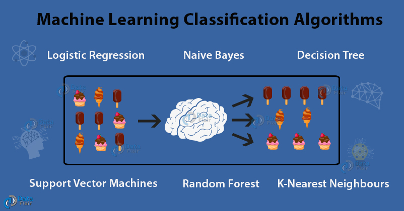
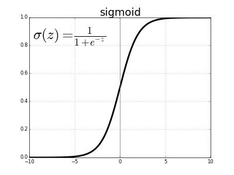
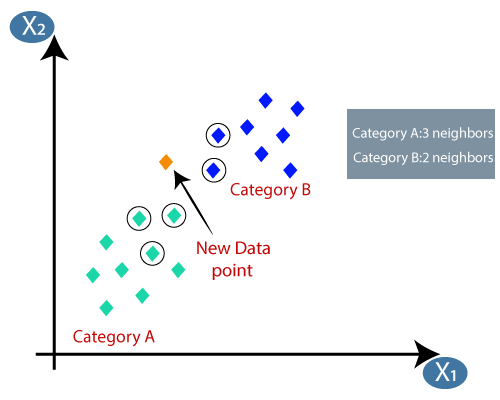

# Classification Algorithms in Machine Learning

Implementing various Classification Algorithms

## Algorithms Covered
The following classification algorithms are implemented in the following code:
- Logistic Regression
- KNN Classifier
- Random Forest
- Decision Tree

### Logistic Regression
It is an unsupervised machine learning algorithm which works on an unlabeled dataset and draw inferences from the same. The logistic regression algorithm is not a Regression Model actually, it is a classification algorithm. It makes use of a logistic function called the Sigmoid function. It’s an S-shaped curve that can take any real-valued number and map it into a value between 0 and 1, but never exactly at those limits.

Logistic Regression is used when the dependent variable(target) is categorical.
For example,
To predict whether an email is spam (1) or (0)
Whether the tumor is malignant (1) or not (0).
In this example we predict the categories of iris which are setosa,virginica and versicolor.

### KNN Classifier
It is a supervised learning algorithm.K-NN algorithm stores all the available data and classifies a new data point based on the similarity. This means when new data is entered then it can be easily classified into a well suite category by using K- NN algorithm. As the name suggests it measures the number of nearest neighbours of a newly entered data point. It uses the Euclidean Distance for calculating the nearest points from each category. The neighbours of whichever category is greater , it predicts the newly entred data a member of that class. Read more about KNN Classifier 
[here](https://www.javatpoint.com/k-nearest-neighbor-algorithm-for-machine-learning).

### Decision Tree
Decision Tree is a Supervised learning technique that can be used for both classification and Regression problems, but mostly it is preferred for solving Classification problems. It is a tree-structured classifier, where internal nodes represent the features of a dataset, branches represent the decision rules and each leaf node represents the outcome. It works in a tree structure where the root node is the best attribute which can classify the dataset. This is followed by recursive calls of the same algorithm and selection of next best attribute in each case until the base case is reached. Read more about Decision Tree 
[here](https://www.javatpoint.com/machine-learning-decision-tree-classification-algorithm).

### Random Forests

## Authors

- [@Sakalya Mitra](https://github.com/Sakalya100)

  
